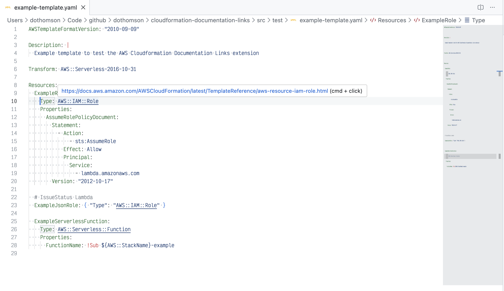
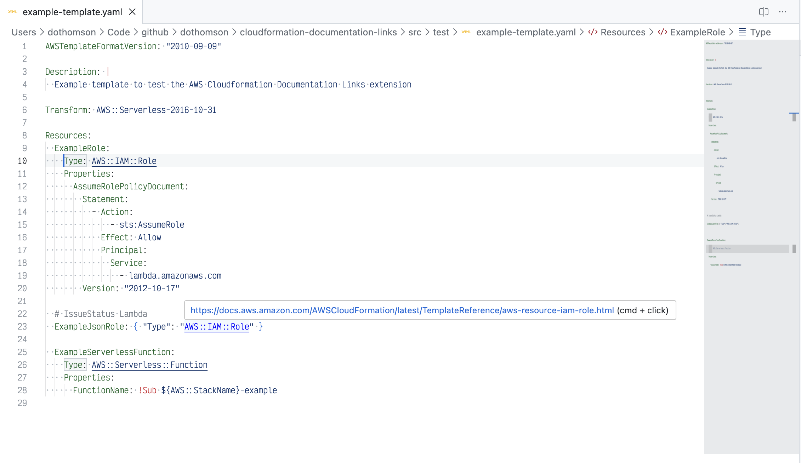
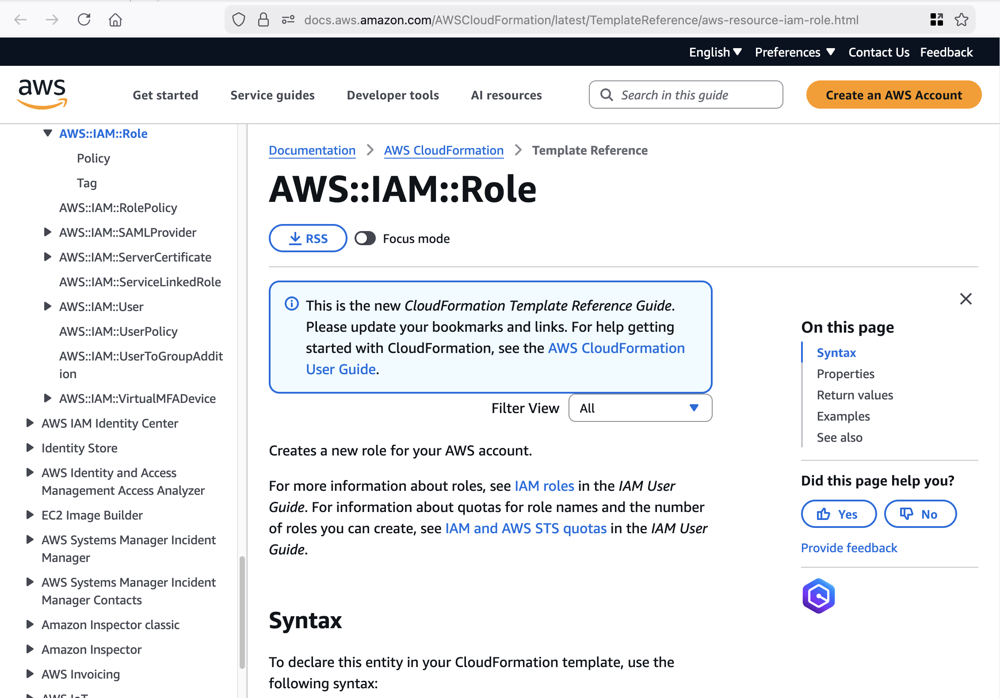
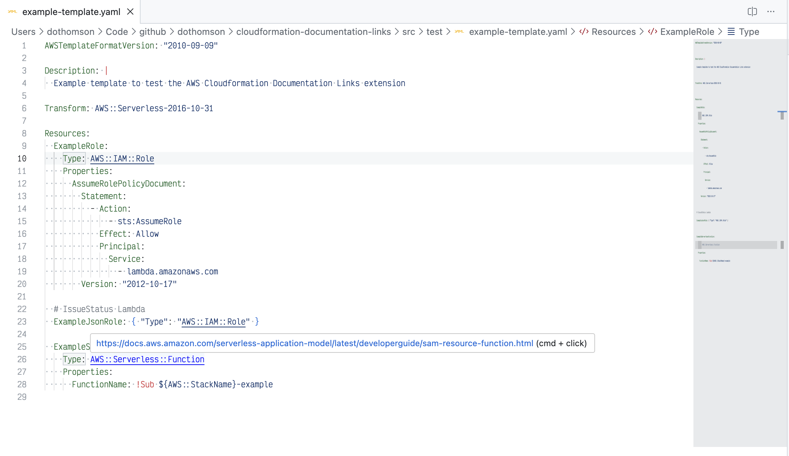
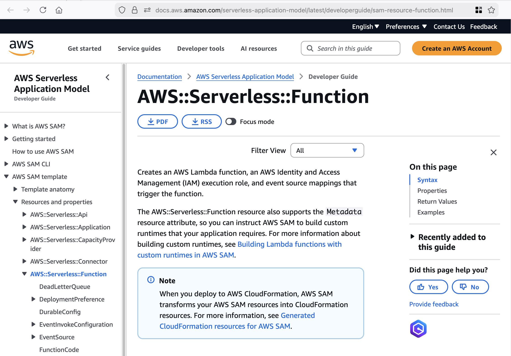

# Cloudformation Documentation Links

This extension add links to AWS resources in CloudFormation templates.

## Features

Adds a link to the AWS documentation when a `Type` declaration is found.

Implementation is basic - it searches each line for a `Type` attribute with a value of an AWS resource. The link uri is constructed using the service name and data type name.

Links work for AWS cloudformation resources and Serverless resources only.

## Known Issues

This extension is activated for all `json` and `yaml` file types which will cause excessive activations. Additionally there isn't a limit to number of lines scanned. This could result in slow down when interacting with large files which are now cloudformation templates.

## Release Notes

### 0.0.1

Initial Release
